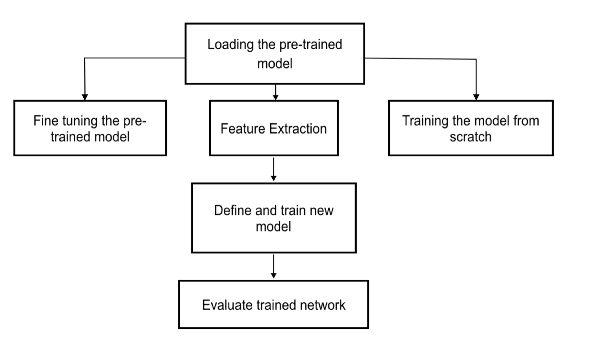

## Project Overview

- Established benchmarks for transfer learning using chemical gas sensor data.
- Utilised pre-trained models for unbalanced data.
- Optimized several deep learning models to improve chemical gas identification.
- Achieved improved performance metrics for binary classification using pre-trained networks.

## Transfer Learning Workflow

## Project Description

An important assumption in machine learning frameworks and algorithms is that the training and test sets must have similar label distributions and that a dataset must have thousands of observations to produce a model that generalizes well. Oftentimes, real-world datasets have dissimilar label distributions and few observations to generate an effective model performance. In such cases, model performance can be improved, if the knowledge acquired through a network trained on a large dataset can be transferred successfully to smaller datasets. This project was an attempt at the proof of concept of transfer learning between gas sensor datasets where the data order is maintained during traning. Initial experimental results indicate significant improvements in model test accuracy and other performance metrics upon applying transfer learning to smaller datasets with label imbalance.

## Project Introduction

Transfer learning can be defined as the process in which the knowledge acquired through the training of one machine learning model can be applied to a similar problem, without having to retrain a new model from scratch. Trnasfer learning can be optimised for target datasets with veru few observations. In this project, datasets related to chemical gas sensors have been utilized to train classifiers using deep neural networks (DNNs) in order to apply transfer learning to smaller but similar datasets. Transfer learning methods using DNNs have been shown to improve a model’s generalization capabilities but have traditionally been applied to perform classification on image and text data and in a few instances, data from motion sensors. This project tackles the challenging task of training classifiers for sensor data for which few benchmark results exist. This is due to a lack of robust pre-trained models for binary classification, unlike pre-trained models such as ResNet and VGG-16 that are applicable for image classification.

## Project Workflow

- MLP on a source dataset
- Transfer learning on dataset 1
- Transfer learning on dataset 2
- Compare results of all models
- Metrics used for binary classification
